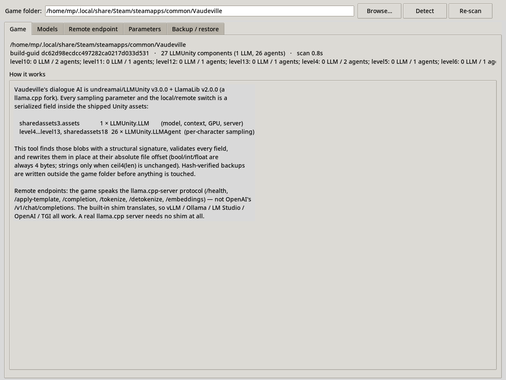
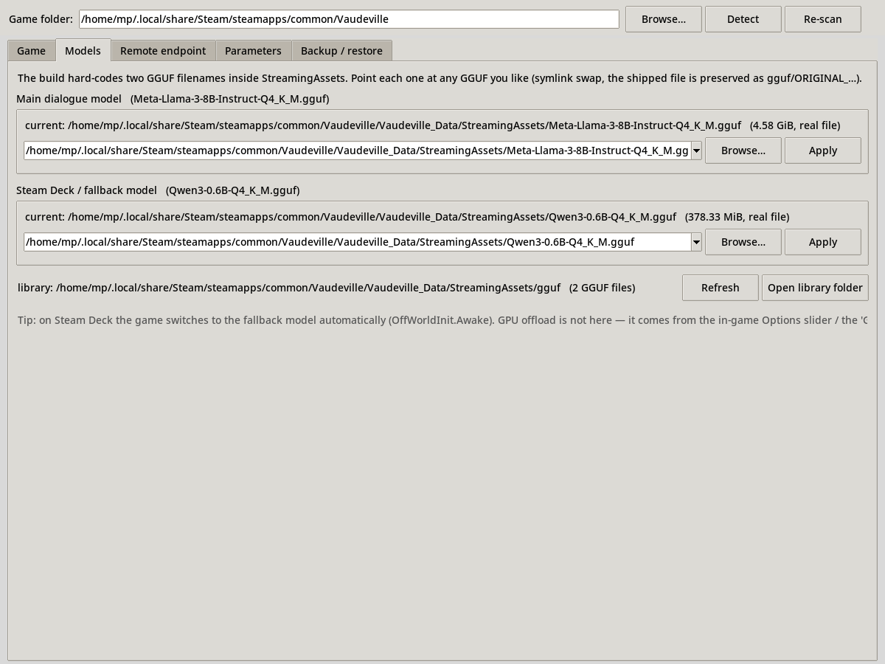
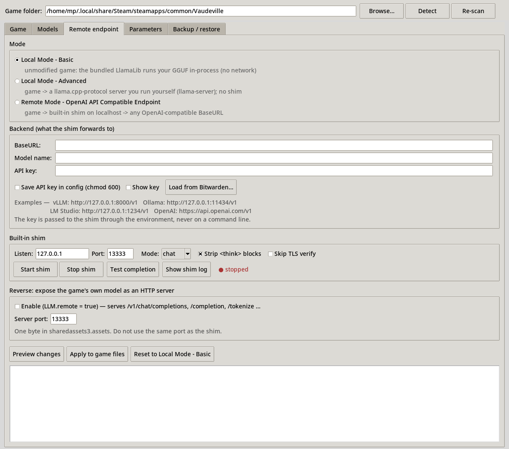
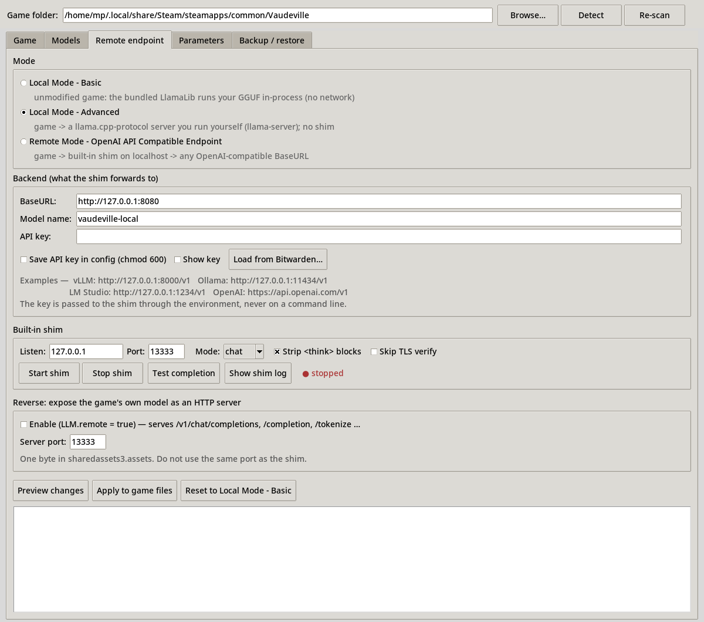
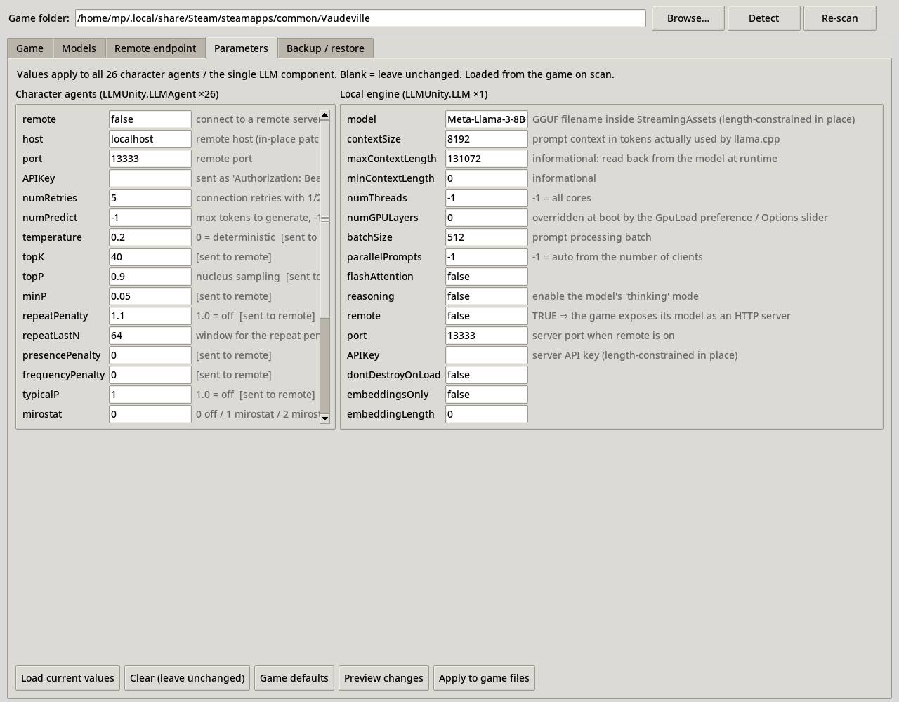
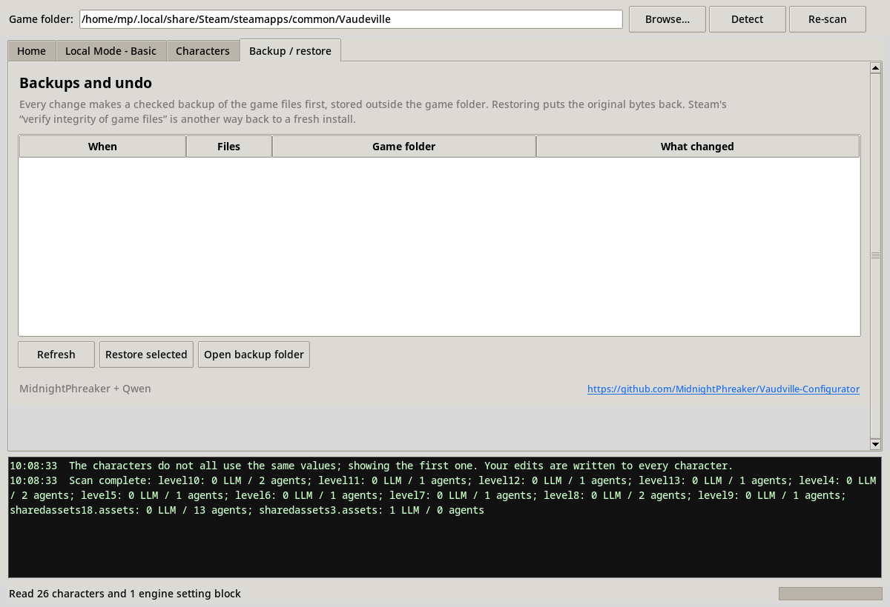

# Vaudville Configurator

**Model / endpoint / sampling-parameter control for Bumblebee Studios' *Vaudeville*
(Steam AppID 2240920) — the Unity game whose dialogue is generated by an on-device LLM.**

One self-contained Python file (standard library + tkinter only), plus a small set of
optional test/proxy tools. No pip installs, no UnityPy, no game recompilation.

```bash
vaudville-configurator            # GUI   (symlink in ~/.local/bin)
vaudville-configurator --selftest # 51 built-in checks, incl. the game's own native lib
vaudeville-llm                    # old alias, same program
```

Source & prebuilt single-file binaries: <https://git.phrk.org/pub/Vaudville-Configurator>.
Releases (Linux binary + Windows exe archives) are published automatically by
`.forgejo/workflows/release.yml` whenever the version in `VERSION` changes, or manually
via *Actions → release → Run workflow* with a `Major` / `minor` / `retry` choice.

The tool offers **three modes**:

| mode | what it means in one line |
|---|---|
| **Local Mode - Basic** | the untouched game: the bundled LlamaLib runs your GGUF in-process; you only tune models, sampling and GPU layers |
| **Local Mode - Advanced** | the game connects straight to a llama.cpp-protocol server *you* run (e.g. `llama-server`), no shim in between |
| **Remote Mode - OpenAI API Compatible Endpoint** | the game talks to the built-in shim, which translates to any OpenAI-compatible BaseURL (vLLM, Ollama, LM Studio, OpenAI, OpenRouter, TGI, …) |

Jump to: [modes](#2-the-three-modes) · [interface tour](#4-the-interface-page-by-page) ·
[quickstarts](#5-quickstart-guides) · [how it works](#6-how-it-works) ·
[safety](#8-safety-model) · [troubleshooting](#10-troubleshooting)

---

## 1. What the game actually does (why this tool exists)

| layer | component |
|---|---|
| Engine | Unity **2022.3.62f2**, **IL2CPP** (`GameAssembly.so`, metadata v31, unencrypted), HDRP/Vulkan |
| Dialogue LLM | **undreamai/LLMUnity v3.0.0** (assembly `undream.llmunity.Runtime.dll`) |
| Native backend | **LlamaLib v2.0.0** = a fork of **llama.cpp** that also embeds llama.cpp's HTTP server (cpp-httplib, statically linked OpenSSL/curl). Variants shipped: `noavx/avx/avx2/avx512/vulkan/cublas` |
| Models | `StreamingAssets/Meta-Llama-3-8B-Instruct-Q4_K_M.gguf` (4.92 GB, main) and `StreamingAssets/Qwen3-0.6B-Q4_K_M.gguf` (Steam-Deck fallback) |
| Speech-to-text | Whisper-family encoder/decoder exported to **Unity Sentis** (`encoder.sentis`, `decoder.sentis`, `LogMelSpectro.sentis`, `vocab.json`; class `StopWhispering`) |
| Text-to-speech | **Overtone** (LeastSquares): `libovertone.so` (espeak-ng) + `libovertoneruntime.so` (ONNX Runtime) + Piper-style VITS voice `en-us-libritts-high` (136 MB ONNX TextAsset) |
| Lip-sync | `SpeechBlendEngine` (MFCC → visemes → blendshapes) |
| RAG/embeddings | LLMUnity RAG + bge-* GGUF URLs + `libusearch_c.so` are shipped but **unused** by the game |

Every sampling parameter and the local/remote switch is a **serialized MonoBehaviour field**
inside the shipped Unity assets (player builds have no type trees, so this tool decodes them
with a structural signature):

```
Vaudeville_Data/sharedassets3.assets            1 × LLMUnity.LLM       (model, context, GPU, server)
Vaudeville_Data/level4 … level13                13 × LLMUnity.LLMAgent (in-scene characters)
Vaudeville_Data/sharedassets18.assets           13 × LLMUnity.LLMAgent (Workshop/Story-Editor prefab)
```

Shipped values (all LLMUnity stock defaults): `temperature 0.2, topK 40, topP 0.9, minP 0.05,
repeatPenalty 1.1, repeatLastN 64, mirostat 0/5.0/0.1, numPredict -1, seed 0, cachePrompt true,
slot -1, remote false, host localhost, port 13333`; LLM: `contextSize 8192, batchSize 512,
numThreads -1, numGPULayers 0 (overridden at boot by the GpuLoad preference), flashAttention false`.

The **only** runtime writes the game makes are: `LLM.numGPULayers` (from `PlayerPrefs["GpuLoad"]`,
default 3, set by the in-game Options slider), `LLM.model` (Steam Deck → Qwen3-0.6B),
`LLMAgent.slot` and `LLMAgent.systemPrompt` (from the 13 character `TextAsset` prompts, or from
`VSVE.Data.StoryEditor*` for Workshop stories). Nothing ever touches temperature/topP/host/…
at runtime — which is exactly why patching the serialized fields works.

---

## 2. The three modes

### 2.1 Local Mode - Basic  (internal key `off`, CLI `--mode basic`)

Nothing networked. The game's bundled LlamaLib loads the GGUF that is linked as
`Meta-Llama-3-8B-Instruct-Q4_K_M.gguf` (or the Steam-Deck fallback) and runs it in-process.
What you can still control: which GGUF each slot points at (Models tab), every sampling
parameter (Parameters tab), and the GPU-layer count.

* **Change to this when:** you want the stock experience, you have no other inference stack,
  or you are troubleshooting ("does the problem exist without my changes?").
* **Do not expect:** remote endpoints, API keys, or a different context window than the
  local engine's `contextSize`.

### 2.2 Local Mode - Advanced  (internal key `direct`, CLI `--mode advanced`)

The 26 `LLMAgent` components get `remote = true` and point at `host:port` of a server that
speaks the **llama.cpp-server protocol** (`/health`, `/apply-template`, `/completion`,
`/tokenize`, …). That is what `llama-server` (any recent llama.cpp build), another LlamaLib,
or the game itself in server mode speak. No shim, no translation, no extra process.

Hard limits inherited from in-place patching (see [6.3](#63-in-place-patching)):

* the host string must stay **9–12 characters** (`127.0.0.1` ✓, `localhost` ✓, `gpu-box.local` ✗)
* **no path prefix** — the library appends `/completion` etc. itself, so `/v1` is impossible
* **no TLS** — `https://` would need 8 extra bytes in the host field

* **Change to this when:** you run your own `llama-server` (newer llama.cpp, Vulkan/CUDA
  build, another machine on the LAN with a short hostname) and want zero extra hops.
* **Do not use when:** your endpoint is an OpenAI-style `/v1/chat/completions` API, needs a
  path, a long hostname, HTTPS, or an API key longer than 0 bytes → use the Remote mode.

### 2.3 Remote Mode - OpenAI API Compatible Endpoint  (internal key `shim`, CLI `--mode remote`)

The agents get `remote = true` but keep `host = localhost` and `port = <shim port>`. The
built-in shim (a ~600-line stdlib HTTP server embedded in this program) accepts the
llama.cpp-server protocol and forwards to **any OpenAI-compatible BaseURL** as
`/v1/chat/completions` (or `/v1/completions` in *raw* mode), translating streaming back into
llama.cpp SSE. It holds the arbitrary BaseURL, model name and API key, and can do TLS for you.

* **Change to this when:** vLLM, Ollama, LM Studio, OpenAI, OpenRouter, TGI, koboldcpp —
  anything OpenAI-compatible, local or remote.
* **Do not forget:** the shim must be running whenever the game is (Start shim button, or
  `--cli shim-start`); and keep a small GGUF linked as the main model because the boot screen
  waits for the local engine ([6.5](#65-the-loading-gate)).

---

## 3. Install & run

Requirements: Python ≥ 3.10 with `tkinter` — Arch: `sudo pacman -S tk`; the python.org
Windows installer ships it (keep *tcl/tk and IDLE* ticked). Nothing else, on any platform.
Screenshots in this README are regenerated with `tools/make_screenshots.sh`, which needs
`xorg-server-xvfb` and `imagemagick`.

```bash
cd ~/Workspace/Vaudville-Configurator
ln -sfn "$PWD/vaudville_configurator.py" ~/.local/bin/vaudville-configurator
vaudville-configurator                       # GUI
vaudville-configurator --cli detect          # headless sanity check
vaudville-configurator --selftest --live     # full verification, incl. the game's native lib
```

### Files

```
Vaudville-Configurator/
├── vaudville_configurator.py     the program (GUI + embedded shim + patcher + CLI + self-test)
├── README.md                     this document
├── docs/screenshots/             the images used below (regenerate with tools/make_screenshots.sh)
├── tools/
│   ├── llamalib_shim.py          standalone copy of the translation shim
│   ├── poc_remote_llamalib.py    ctypes PoC: drives the game's own libllamalib in remote mode
│   ├── mock_openai_backend.py    fake OpenAI-compatible backend used by the tests
│   ├── make_screenshots.sh       headless (Xvfb) regeneration of docs/screenshots/
│   ├── vaudville-configurator.cmd  Windows launcher (py -3 …, falls back to python)
│   ├── build_package.sh            builds the single-file executable (Linux/macOS)
│   └── build_package.cmd           builds the single-file .exe (on Windows)
│   └── llama.cpp -> …            symlink to a downloaded llama.cpp release (for the tests)
└── tests/
    ├── run_e2e_test.sh           mock backend + shim + PoC (MODE=chat|raw), no llama.cpp needed
    ├── run_direct_llama_test.sh  game lib -> a real llama-server, no shim
    └── run_real_backend_test.sh  both paths against a real llama-server + your Qwen3-0.6B GGUF
```

| file | path-sensitive? |
|---|---|
| `vaudville_configurator.py` | **no** — fully self-contained; the embedded shim is started by re-executing this file (`Path(__file__)`), so it works from any directory and any layout |
| `tools/*.py` | no (standalone). `poc_remote_llamalib.py` finds the game's own `libllamalib` by itself: `$VLM_NATIVE_LIB`, then `<sibling>/Vaudeville`, `~/Workspace/Vaudeville`, and the two usual Steam library paths. Override per run with `--lib`. |
| `tests/*.sh` | resolve their siblings automatically: `tools/` is found as `$HERE/../tools`, `$HERE/tools` or `$HERE`; `llama-server` via `$LLAMA_BIN_DIR`, then `tools/llama.cpp`, then two known fallback paths; the test GGUF via `$VLM_TEST_MODEL`, else the first `Qwen3-0.6B-Q4_K_M.gguf` found in a Vaudeville install. They can be run from **any** cwd and in any style — `bash tests/run_e2e_test.sh`, `./tests/run_e2e_test.sh`, `cd tests && ./run_e2e_test.sh`, or by absolute path. Move the whole tree freely. |

Runtime state (created on demand, never next to these files):

```
~/.config/vaudville-configurator/config.json        # settings; API key only if you tick "save key" (chmod 600)
~/.local/state/vaudville-configurator/              # asset-profile.json, manager.log, shim.log, shim-config.json, shim.pid
~/.local/share/vaudville-configurator/backups/      # hash-verified backups of patched game files
tests/logs/                                         # per-run logs of the test scripts
```

Launchers (repoint them if you move `vaudville_configurator.py`):

```bash
ln -sfn "$PWD/vaudville_configurator.py" ~/.local/bin/vaudville-configurator
ln -sfn "$PWD/vaudville_configurator.py" ~/.local/bin/vaudeville-llm     # legacy alias
```

Do **not** put any of these inside the game's `Vaudeville_Data/` tree (Steam verifies it).

### Headless CLI

```bash
vaudville-configurator --cli detect
vaudville-configurator --cli list [--show-prompts]
vaudville-configurator --cli models
vaudville-configurator --cli set-model --slot primary|deck --model /path/to/Model.gguf [--dry-run]
vaudville-configurator --cli plan  --mode remote --backend-url http://127.0.0.1:8000/v1 \
                                   --backend-model Qwen3-32B \
                                   --set temperature=0.9 --set numPredict=256
vaudville-configurator --cli apply  …same flags… --yes     # writes, with a verified backup
vaudville-configurator --cli backups
vaudville-configurator --cli restore [--backup NAME|latest] --yes
vaudville-configurator --cli shim-start | shim-status | shim-test | shim-stop
vaudville-configurator --selftest [--live]
```

`--mode` accepts the new names and the old keys interchangeably:
`basic|off`, `advanced|direct`, `remote|shim` (plus `local`, `local-basic`, `local-advanced`,
`openai`, `remote-openai`, …). Useful flags: `--game-dir PATH`, `--rescan`,
`--api-key-env VAR` (read the key from the environment), `--llm-set NAME=VALUE`,
`--expose-server --server-port N`, `--tab NAME`, `--geometry WxH`, `--quit-after N`.

---

## 4. The interface, page by page

Every screenshot below is a real capture of the program (regenerate them with
`tools/make_screenshots.sh`; they run under Xvfb and never touch your config).

### 4.1 Game tab — where the game is and what was found



| control | what it is / does | plays with | change it when | leave it alone when |
|---|---|---|---|---|
| **Game folder** + *Browse…* | the Vaudeville install every action targets | detection below | you keep a second copy (modding sandbox, Steam Deck transfer) | the auto-detected Steam install is correct |
| *Detect* | re-runs Steam detection: `libraryfolders.vdf` → `appmanifest_2240920.acf` → `installdir`, plus `steamapps/common` scan, Flatpak Steam, `$STEAMPATH`, sibling copies | Game folder | the field is empty or points at a stale path | — |
| *Re-scan* | decodes all 27 LLMUnity components again (≈1 s) and reloads the Parameters tab from disk | Parameters tab | after an Apply, after a Steam verify, or when values look stale | nothing changed since the last scan |
| info block | path, build-guid, component counts, per-file summary | — | — | — |
| red "game is running" label | live `/proc/*/exe` poll; **all writes are blocked while it runs** | Apply buttons | — | never ignore it: patching a running game corrupts the session |
| "How it works" panel | the stack summary from section 1 | — | — | — |

### 4.2 Models tab — which GGUF the build loads



The build hard-codes two *filenames* inside `StreamingAssets`. This tab repoints each one.

| control | what it is / does | plays with | change it when | leave it alone when |
|---|---|---|---|---|
| **Main dialogue model** combo + *Browse…* + *Apply* | atomic symlink swap of `Meta-Llama-3-8B-Instruct-Q4_K_M.gguf`; a shipped real file is first moved to `StreamingAssets/gguf/ORIGINAL_…`, never deleted | loading gate (6.5), Parameters `contextSize` | you have a better local GGUF (same or smaller context, chat-tuned) | in Remote/Advanced mode keep the **small** Qwen3-0.6B here — the boot screen waits for it |
| **Steam Deck / fallback model** combo | same for `Qwen3-0.6B-Q4_K_M.gguf` (chosen automatically on Deck by `OffWorldInit.Awake`) | — | you want a different fallback | on desktop it is only used as the loading-gate model in remote modes |
| *Refresh* | re-lists `StreamingAssets/gguf/**/*.gguf` + `StreamingAssets/*.gguf` | library folder | after dropping a new GGUF in the library | — |
| *Open library folder* | creates `<StreamingAssets>/gguf/` if needed and opens it in your file manager | Refresh | you are adding models | — |
| library line | shows the library path and how many GGUFs are visible | — | — | — |

Notes: the swap is a symlink, so Steam's verify-integrity restores the original file and your
GGUF stays in the library. Model *names* longer than the in-place string budget are fine here
because the symlink keeps the shipped filename.

### 4.3 Remote endpoint tab — the mode switch and everything networked

This is the page the three modes live on; the screenshots show each mode selected.

**Local Mode - Basic**



**Local Mode - Advanced**



**Remote Mode - OpenAI API Compatible Endpoint**


| control | what it is / does | plays with | change it when | leave it alone when |
|---|---|---|---|---|
| **Mode** radios | the three modes of section 2; writes `LLMAgent.remote` (+ `host`/`port`) on Apply | everything on this page | see 2.1–2.3 | Basic is the safe default |
| **BaseURL** | OpenAI-compatible endpoint the **shim** forwards to, e.g. `http://127.0.0.1:8000/v1`, `http://127.0.0.1:11434/v1`, `https://api.openai.com/v1`. In Advanced mode it is parsed as `host[:port]` only | shim Mode, Model name, API key | Remote mode: always set it. Advanced mode: host must be 9–12 chars, no path, no https | Basic mode ignores it entirely |
| **Model name** | the `model` field sent to the backend (vLLM served name, Ollama tag, `gpt-4o-mini`, …) | BaseURL | Remote mode: whenever the backend expects a specific id | Basic/Advanced: LlamaLib does not send a model name |
| **API key** | sent as `Authorization: Bearer …` by the shim; passed to the shim through the **environment**, never argv | Save/Show/Bitwarden | your endpoint requires auth | leave empty for local unauthenticated servers |
| *Save API key in config* | persists the key in `~/.config/…/config.json` (chmod 600) | API key | the machine is yours and disk encryption is on | shared machines — use `--api-key-env` or Bitwarden instead |
| *Show key* | unmasks the field | — | verifying a paste | screenshots/sharing your screen |
| *Load from Bitwarden…* | `bw list items --search llm`, pick an item, take its password/hidden field into the field (never logged) | API key | you keep keys in Bitwarden | — |
| **Listen / Port** (shim) | where the shim binds; the agents are patched to `localhost:<port>` | game's own server port | 13333 collides with something | the default is what the game's stock `port` already is |
| **Mode** (chat/raw) | shim translation: *chat* → `/v1/chat/completions` with roles preserved; *raw* → `/v1/completions` with the templated prompt | BaseURL | backend has no chat endpoint, or you want the game's template applied server-side | chat is right for 99 % of backends |
| *Strip `<think>` blocks* | removes reasoning blocks (handles tags split across chunks) before they reach dialogue/TTS | reasoning models | keep **on** for Qwen3/DeepSeek-R1 style models | your model never emits `<think>` |
| *Skip TLS verify* | disables certificate checks in the shim's HTTPS client | https BaseURLs | self-signed homelab cert | anything else — fix the cert instead |
| *Start / Stop shim* | launches/stops the embedded shim as a background process (`shim.pid`, log in state dir) | Test completion | before every game session in Remote mode | Basic/Advanced modes need no shim |
| *Test completion* | one real `/completion` round-trip through the shim → backend | shim, BaseURL | after any backend change, before playing | — |
| *Show shim log* | tails the shim log in a window | — | debugging | — |
| **Reverse: expose the game's model** + **Server port** | flips `LLM.remote = true` (one byte) so the *game itself* serves its loaded model as an OpenAI-compatible server on that port | shim port (must differ) | you want other tools to use the game's model | almost always — it costs RAM and a port |
| *Preview changes* | dry run: lists every byte edit with file+offset, plus BLOCKED/NOTE lines | Apply | always, before Apply | — |
| *Apply to game files* | hash-verified backup → in-place byte edits → re-decode verification | Backup tab | after a satisfactory preview | while the game runs (blocked anyway) |
| *Reset to Local Mode - Basic* | sets mode back to Basic and previews the revert | — | undoing remote experiments | — |
| plan box | the preview output: notes, warnings, edit count | — | — | — |

### 4.4 Parameters tab — every serialized field



Left column = the 26 `LLMAgent` components (all characters, edited together); right column =
the single `LLM` component (local engine). **Blank = leave unchanged.** *Load current values*
fills the form from the game; *Game defaults* fills LLMUnity's shipped values.

#### Character agents (`LLMUnity.LLMAgent` ×26)

| field | what it is / does | plays with | change it when | leave it alone when |
|---|---|---|---|---|
| `remote` | 0/1: talk to a server instead of the in-process engine | Mode radios (this is what they write) | only via the Mode radios, so host/port stay consistent | hand-editing it without host/port |
| `host` | server hostname; in-place limit 9–12 chars | BaseURL, mode | Advanced mode with a short LAN hostname | Remote mode (the shim wants `localhost`) |
| `port` | server port | shim Port / server port | your server is not on 13333 | default already matches |
| `APIKey` | Bearer token sent by LlamaLib; shipped empty ⇒ cannot grow in place | shim API key | never (use the shim) | always |
| `numRetries` | connection retries with 1/2/4/8/16/30 s backoff | — | flaky LAN server | default 5 is fine |
| `numPredict` | max tokens per reply, `-1` = unlimited | backend context | you want shorter/cheaper replies | `-1` lets characters finish their lines |
| `temperature` | randomness; 0 = deterministic | topK/topP/minP | dialogue feels canned (try 0.7–0.9) | you want reproducible Workshop-story behaviour (0.2) |
| `topK` | keep k most likely tokens | temperature | flavour tuning | >100 rarely helps |
| `topP` | nucleus cutoff | temperature | with temperature for variety | >1.0 is meaningless |
| `minP` | floor relative to top probability | topP | modern llama.cpp sampling taste | 0.05 stock is sane |
| `repeatPenalty` | 1.0 = off; punishes repeats | repeatLastN | characters loop phrases | >1.3 makes prose awkward |
| `repeatLastN` | window for the penalty | repeatPenalty | loops persist | 64 stock |
| `presencePenalty` / `frequencyPenalty` | OpenAI-style penalties, forwarded by the shim | — | backend honours them and you see repetition | stock 0 |
| `typicalP` | 1.0 = off; typical sampling | — | experimenting | 1.0 |
| `mirostat`, `mirostatTau`, `mirostatEta` | mirostat 0/1/2 sampler | temperature | you specifically want mirostat | 0 (off) is the sane default |
| `seed` | 0 = random | — | reproducible sessions/tests | normal play |
| `cachePrompt` | reuse the KV cache between turns | contextSize | almost never off | keep true (big speedup) |
| `ignoreEos` | generate past end-of-text | numPredict | debugging | normal play |
| `nProbs` | return top-N probabilities | — | debugging | 0 |
| `slot` | server slot; remote clients are forced to `-1` (auto) | — | never | always |
| `grammar` | GBNF/JSON schema; length-constrained in place | — | structured output experiments | normal play |

#### Local engine (`LLMUnity.LLM` ×1)

| field | what it is / does | plays with | change it when | leave it alone when |
|---|---|---|---|---|
| `model` | GGUF filename in StreamingAssets; in-place limit 33–36 chars | Models tab (preferred) | never by hand — use the symlink swap | always |
| `contextSize` | prompt context the **local** engine allocates | RAM/VRAM, loading time | you have headroom and long scenes (8192→16384) | remote modes (the server decides) |
| `maxContextLength` / `minContextLength` | informational, read back from the model | — | never | always |
| `numThreads` | CPU threads, `-1` = all | — | you want cores left for the game | `-1` |
| `numGPULayers` | GPU offload; **overridden at boot** by the in-game Options slider / `GpuLoad` preference | in-game Options | you never touch the in-game slider | you use the in-game slider (it wins) |
| `batchSize` | prompt-processing batch | load time | very long prompts | 512 |
| `parallelPrompts` | `-1` = auto from client count | — | debugging | `-1` |
| `flashAttention` | FA in the local engine | contextSize, RAM | supported build + big context | stock false |
| `reasoning` | enables the model's "thinking" mode | shim *Strip `<think>`* | your GGUF is a reasoning model and you keep stripping on | non-reasoning models |
| `remote` + `port` + `APIKey` | the **reverse** server switch (game serves its model) | Reverse checkbox on the Remote tab | via that checkbox | by hand |
| `dontDestroyOnLoad`, `embeddingsOnly`, `embeddingLength` | unused-by-default engine flags | — | never | always |

### 4.5 Backup / restore tab



| control | what it is / does | change it when | leave it alone when |
|---|---|---|---|
| list | every backup dir with timestamp, file count, game path and the edit labels that created it | — | — |
| *Refresh* | re-reads `~/.local/share/vaudville-configurator/backups/` | after applies from the CLI | — |
| *Restore selected* | copies the backed-up files back byte-for-byte and re-verifies sha256 | undoing anything | the current state is what you want |
| *Open backup folder* | file manager on the backup root | manual inspection | — |

Steam's *verify integrity of game files* is the second, independent way back to stock.

---

## 5. Quickstart guides

All three start the same way and all three end with a concrete, ready-to-play configuration.

### 5.1 Quickstart — Local Mode - Basic

*Goal: the stock game, but with sampling (and optionally the model) tuned to your taste.
No extra processes, nothing networked.*

1. **Run the configurator**
   ```bash
   vaudville-configurator
   ```
   The Game tab auto-detects your Steam install; wait for the scan line
   (`27 components`) in the log box.
2. **Game tab** — confirm the folder and the component counts (1 LLM, 26 agents).
3. **Models tab** (optional) — pick a different GGUF for *Main dialogue model* and *Apply*.
   Keep a chat-tuned model of ≤ 8B at Q4 for CPU play; the Steam-Deck slot can stay stock.
4. **Remote endpoint tab** — select **Local Mode - Basic**, then *Preview changes* and confirm
   the plan says `Local Mode - Basic: agents use the in-process llama.cpp service`.
5. **Parameters tab** — *Load current values*, then set the values from the table below and
   *Preview changes* → *Apply to game files* (a hash-verified backup is written first).
6. **Play.** Launch Vaudeville from Steam as usual. Nothing else needs to run.

Recommended settings (Local Mode - Basic):

| setting | value | why |
|---|---|---|
| mode | `Local Mode - Basic` | stock inference path |
| main model | stock `Meta-Llama-3-8B-Instruct-Q4_K_M.gguf` (or your own chat GGUF) | the build's hard-coded name |
| `temperature` | `0.8` | stock 0.2 is very flat for improv dialogue |
| `topP` | `0.95` | pairs well with 0.8 |
| `minP` | `0.05` | stock |
| `repeatPenalty` / `repeatLastN` | `1.15` / `64` | tames looping without breaking prose |
| `numPredict` | `-1` | let characters finish |
| `contextSize` | `8192` (or `4096` on a weak CPU) | local engine only; bigger = slower first reply |
| `numGPULayers` | set with the **in-game Options slider** | it overrides the serialized value at boot |

Ready to play (CLI equivalent of steps 4–5):

```bash
vaudville-configurator --cli apply --mode basic \
    --set temperature=0.8 --set topP=0.95 --set minP=0.05 \
    --set repeatPenalty=1.15 --set repeatLastN=64 --set numPredict=-1 \
    --llm-set contextSize=8192 --yes
# then: steam steam://rungameid/2240920
```

### 5.2 Quickstart — Local Mode - Advanced

*Goal: the game drives **your own llama.cpp server** (newer llama.cpp, CUDA/Vulkan build,
another box on the LAN) with no shim in between.*

1. **Run the configurator**
   ```bash
   vaudville-configurator
   ```
2. **In a second terminal, start your server** (any build that speaks the
   llama.cpp-server protocol):
   ```bash
   llama-server -m ~/models/Qwen3-8B-Instruct-Q4_K_M.gguf \
                --host 127.0.0.1 --port 8080 -c 8192 -ngl 99 --jinja
   ```
   Check `curl -s http://127.0.0.1:8080/health` → `200`.
3. **Models tab** — link the **small** `Qwen3-0.6B-Q4_K_M.gguf` as *Main dialogue model*.
   The boot screen waits for the local engine even in remote modes
   ([6.5](#65-the-loading-gate)); the 0.6B model starts in ~1 s.
4. **Remote endpoint tab** — select **Local Mode - Advanced** and set
   **BaseURL** to `http://127.0.0.1:8080` (host `127.0.0.1` = 9 chars ✓, **no `/v1`**,
   **no `https`**). *Model name* and *API key* stay empty.
5. *Preview changes* — the plan must say
   `Local Mode - Advanced: agents -> http://127.0.0.1:8080 directly …`.
   If you see `BLOCKED (Local Mode - Advanced): …` notes, fix host/port or switch to
   Remote mode. Then *Apply to game files*.
6. **Parameters tab** — set your sampling values (they are forwarded to the server in the
   `/completion` payload) and Apply.
7. **Play** with the server running. Verify first if you like:
   `bash tests/run_direct_llama_test.sh` drives the game's own library at a real server.

Recommended settings (Local Mode - Advanced):

| setting | value | why |
|---|---|---|
| mode | `Local Mode - Advanced` | zero extra hops |
| BaseURL | `http://127.0.0.1:8080` | must be `host[:port]`, 9–12-char host, no path, no TLS |
| main model (Models tab) | `Qwen3-0.6B-Q4_K_M.gguf` | satisfies the loading gate |
| server `-c` | ≥ your `contextSize` wish | the **server** owns the context now |
| `temperature` / `topP` | `0.8` / `0.95` | as above |
| `numPredict` | `-1` | as above |
| `cachePrompt` | `true` | big speedup between turns |

Ready to play:

```bash
vaudville-configurator --cli set-model --slot primary \
    --model ~/.local/share/Steam/steamapps/common/Vaudeville/Vaudeville_Data/StreamingAssets/Qwen3-0.6B-Q4_K_M.gguf
vaudville-configurator --cli apply --mode advanced --backend-url http://127.0.0.1:8080 \
    --set temperature=0.8 --set topP=0.95 --set numPredict=-1 --set cachePrompt=true --yes
# keep `llama-server …` running, then launch the game
```

### 5.3 Quickstart — Remote Mode - OpenAI API Compatible Endpoint

*Goal: any OpenAI-compatible backend — vLLM, Ollama, LM Studio, OpenAI, OpenRouter, TGI —
local or remote, with API key and TLS if needed.*

1. **Run the configurator**
   ```bash
   vaudville-configurator
   ```
2. **Know your endpoint**, e.g.
   | backend | BaseURL | model name |
   |---|---|---|
   | vLLM | `http://127.0.0.1:8000/v1` | the served id, e.g. `Qwen/Qwen3-8B` |
   | Ollama | `http://127.0.0.1:11434/v1` | e.g. `qwen3:8b` |
   | LM Studio | `http://127.0.0.1:1234/v1` | the loaded model id |
   | llama.cpp server | `http://127.0.0.1:8080/v1` | anything it serves |
   | OpenAI | `https://api.openai.com/v1` | e.g. `gpt-4o-mini` |
   | OpenRouter | `https://openrouter.ai/api/v1` | e.g. `meta-llama/llama-3.1-70b-instruct` |
3. **Models tab** — link the **small** `Qwen3-0.6B-Q4_K_M.gguf` as *Main dialogue model*
   (loading gate, see 5.2 step 3).
4. **Remote endpoint tab** — select **Remote Mode - OpenAI API Compatible Endpoint**, then:
   * **BaseURL** = your endpoint (path allowed, https allowed)
   * **Model name** = the id from the table
   * **API key** = paste, or *Load from Bitwarden…*; tick *Save API key* only if you want it
     persisted (chmod 600). Prefer `--api-key-env VLM_API_KEY` on shared machines.
   * shim **Listen/Port** = `127.0.0.1` / `13333` (default), **Mode** = `chat`,
     **Strip `<think>` blocks** on for reasoning models.
5. **Start shim**, then **Test completion** — you should see a one-line reply in the log box.
   If it fails, *Show shim log* and fix BaseURL/model/key.
6. *Preview changes* → the plan must say
   `Remote Mode - OpenAI API Compatible Endpoint: agents -> built-in shim on localhost:13333 -> …`
   → *Apply to game files*.
7. **Parameters tab** — sampling values (forwarded through the shim) → Apply.
8. **Play** with the shim running. The shim survives GUI closes (it is a background process);
   stop it with *Stop shim* or `--cli shim-stop`. For autostart, add
   `vaudville-configurator --cli shim-start` to your session startup.

Recommended settings (Remote Mode):

| setting | value | why |
|---|---|---|
| mode | `Remote Mode - OpenAI API Compatible Endpoint` | arbitrary BaseURL/model/key/TLS |
| BaseURL / Model name | your endpoint / its model id | sent on every request |
| shim Mode | `chat` | roles preserved; `raw` only for completion-only backends |
| Strip `<think>` | on | reasoning text would otherwise be spoken by the TTS |
| main model (Models tab) | `Qwen3-0.6B-Q4_K_M.gguf` | loading gate |
| `temperature` / `topP` | `0.8` / `0.95` | as above |
| `numPredict` | `256`–`512` for paid APIs, `-1` locally | cost control vs. completeness |

Ready to play:

```bash
export VLM_API_KEY=…                       # or: bw get password <item>
vaudville-configurator --cli set-model --slot primary \
    --model ~/.local/share/Steam/steamapps/common/Vaudeville/Vaudeville_Data/StreamingAssets/Qwen3-0.6B-Q4_K_M.gguf
vaudville-configurator --cli apply --mode remote \
    --backend-url https://api.example.org/v1 --backend-model llama-3.1-70b-instruct \
    --api-key-env VLM_API_KEY \
    --set temperature=0.8 --set topP=0.95 --set numPredict=512 --yes
vaudville-configurator --cli shim-start && vaudville-configurator --cli shim-test
# then launch the game
```

---

## 6. How it works

### 6.1 Detection
`steamapps/libraryfolders.vdf` → library roots → `appmanifest_2240920.acf` → `installdir`;
plus `steamapps/common` scan, Flatpak Steam, `$STEAMPATH`, non-Steam copies next to the CWD,
and the CWD itself. Verified with `Vaudeville_Data/StreamingAssets` + `app.info`.

### 6.2 Component scanning (no UnityPy)
Each asset file is mmap'd and searched for structural anchors:

* `LLMAgent`: the `host` string slot (`localhost`) and the LLMUnity default system-prompt
  prefix; the blob start is then derived and **every** field range-checked
  (bools ∈ {0,1}, ports ≤ 65535, temperature ∈ [0,4], …), the `m_Name` slot before the blob
  must be empty, and the `_llm` PPtr must be plausible.
* `LLM`: any length-prefixed `*.gguf` filename; blob start derived, same validation.

False positives are effectively impossible and the scan is value-tolerant (it still finds the
components after you have patched them). ~1.5 s for all ~7 GB of assets. Offsets are cached per
build-guid in `asset-profile.json` and re-validated on every run.

### 6.3 In-place patching
Unity serializes `bool` as **4 bytes**, `int32`/`float32` as 4 bytes → always patchable.
A `string` is `int32 length + bytes + pad-to-4`; the blob size is fixed, so a string may only be
replaced when `ceil4(len(new)) == ceil4(len(old))`. Consequences the tool explains instead of
silently corrupting:

* `host` ("localhost", 9) accepts any **9–12 character** host: `127.0.0.1`, `192.168.1.50`,
  `llm-server` ✓ — `gpu-box.local` (13), `https://…`, or anything with a `/v1` path ✗.
* `APIKey` is empty in the shipped build, so it can never grow in place → keep the key in the
  shim (or use BepInEx).
* `model` (36) accepts 33–36 characters.

Before writing: hash-verified backup outside the game tree; the file is re-read and compared
against the scan at each offset; after writing the components are re-decoded and shown.

### 6.4 The shim (why Remote mode needs it)
In remote mode the game's native library POSTs the **llama.cpp-server** protocol, not OpenAI's:

```
POST /health            -> 2xx
POST /apply-template    {"messages":[…]}            -> {"prompt":"…"}
POST /completion        {"prompt","n_predict","temperature","top_k","top_p","min_p",
                          "repeat_penalty","repeat_last_n","presence_penalty",
                          "frequency_penalty","typical_p","mirostat","mirostat_tau",
                          "mirostat_eta","seed","ignore_eos","n_probs","cache_prompt",
                          "grammar"|"json_schema","id_slot","stream"}
                        -> {"content":"…"}   or SSE "data: {…}" chunks with "content"
POST /tokenize          {"content":"…"}             -> {"tokens":[…]}
POST /detokenize        {"tokens":[…]}              -> {"content":"…"}
POST /embeddings        {"content":"…"}             -> [{"embedding":[…]}]
Authorization: Bearer <APIKey>      "https://" in the host string enables TLS
```

The shim accepts exactly that and forwards to any OpenAI-compatible backend
(`/v1/chat/completions` in *chat* mode with the messages preserved, `/v1/completions` in *raw*
mode), translating streaming back into llama.cpp SSE. Two hard-won details:

* **Never emit `data: [DONE]`.** LlamaLib's `ResponseConcatenator` returns false on it, which
  makes cpp-httplib treat the transfer as failed → 6 retries (1/2/4/8/16/30 s) and the text is
  discarded. The shim ends the chunked response without it.
* **Reasoning models leak `<think>…</think>`** into the dialogue box *and the TTS*.
  The shim strips them by default (`--keep-think` disables), handling tags split across chunks.

A **real llama.cpp `llama-server` needs no shim** — pick *Local Mode - Advanced*
(host length permitting).

### 6.5 The loading gate
`OffWorldInit.CheckLoading` waits for `LLM.started` (byte at `LLM+0x80`). In remote mode the
local service is still constructed, so **keep a small GGUF linked as the main model**
(e.g. `Qwen3-0.6B-Q4_K_M.gguf`) or the boot screen hangs. The GUI says this whenever remote
mode is planned.

---

## 7. Modding routes, ranked

| # | route | what you get | effort |
|---|---|---|---|
| A | **this tool, Remote mode**: flip `remote` on the 26 agents + run the built-in shim | any OpenAI-compatible backend (vLLM, Ollama, LM Studio, OpenAI, TGI), arbitrary BaseURL/model/key, all sampling params | one click |
| A′ | **this tool, Advanced mode** at a real `llama-server` | newer llama.cpp, another GPU box, no shim | one click |
| B | **BepInEx 6 IL2CPP** (`BepInEx-Unity.IL2CPP-linux-x64-*`) + a C# plugin | arbitrary host/key/strings, per-character prompts, bypass the loading gate, UI | medium |
| C | **replace `libllamalib_linux-x64_*.so`** (Apache-2.0/MIT; full C ABI is mapped) | any inference engine behind the ABI; newer llama.cpp builds | high |
| D | zero-patch levers | `LLMManager.json` → `"debugMode": 0` = full llama.cpp logging; `GpuLoad` preference / Options slider = GPU offload; GGUF symlink swap; per-save chat-history JSON; the in-game Story Editor + Steam Workshop for new prompts | none |
| E | **reverse**: `LLM.remote = true` (one byte) | the game serves its loaded model as an OpenAI-compatible server on `:port` | one click |

System prompts are 5–8 KB variable-length `TextAsset`s → not resizable in place; use B, D or E.

---

## 8. Safety model

* writes are **blocked while the game process is running** (`/proc/*/exe` check, polled in the GUI)
* every write is preceded by a **hash-verified backup** in
  `~/.local/share/vaudville-configurator/backups/<UTC>-<dirname>/` with a `manifest.json`
  (per-file sha256 before/after, edit labels); restore re-verifies
* string fields are size-constrained (see 6.3) — the tool refuses and explains rather than
  corrupting; byte edits are re-read and compared before being written
* the API key goes to the shim through the environment (`VLM_API_KEY`), never argv; it is only
  persisted if you tick *Save API key* (config file is chmod 600); *Load from Bitwarden…* uses
  `bw` and never logs the secret
* Steam's *verify integrity of game files* is always a way back to stock
* nothing is ever written inside `Vaudeville_Data/` except the two model symlinks you choose
  (and the `gguf/` library folder that *Open library folder* creates on demand)

---

## 9. Verification status

`--selftest --live` → **51/51 checks passed** (50 without `--live`; python 3.14, this machine):

* mode names/order/aliases 3/3 (the three labels, all 18 CLI/config aliases, fallbacks)
* platform helpers 7/7: per-platform user dirs, the Windows `tasklist` CSV parser
  (sample output, exercised on Linux), Windows-style install detection (`.exe`),
  symlink/hardlink linking, detach flags and process listing
* ThinkStripper 10/10 (split tags, multiple blocks, unterminated)
* detection of both the Steam install and a non-Steam copy
* scan: exactly 1 `LLMUnity.LLM` + 26 `LLMUnity.LLMAgent`, all in range
* dry run: size-preserving edits for all 26 agents
* shim protocol in-process: `/health`, `/apply-template` (roles preserved), `/completion`
  non-stream and streaming (no `[DONE]`, exact reassembly), `/tokenize`, `/embeddings`;
  backend saw `Authorization: Bearer …` and the right model
* shim as subprocess: start → health → test → stop → port released
* **native proof**: the game's own `libllamalib_linux-x64_avx2.so` driven through
  `LLMClient_Construct_Remote → LLM_Set_Completion_Parameters → LLMAgent_Construct →
  LLMAgent_Chat` against the shim

Additionally exercised for real: a 104-edit apply (`remote`, `temperature`, `topP`,
`numPredict` on all 26 agents), re-decode, and a sha256-verified restore; live runs of the
game's library against a real `llama-server` (b10889) serving `Qwen3-0.6B-Q4_K_M.gguf`, both
directly (Advanced mode path) and through the shim (Remote mode path); and all three
`tests/*.sh` scripts from several working directories.

The **GUI** was verified by headless Xvfb screenshots of all five tabs (the images in
section 4, regenerated by `tools/make_screenshots.sh`) and by `--gui-check`.

---

## 10. Troubleshooting

| symptom | cause / fix |
|---|---|
| boot screen hangs after enabling Advanced/Remote | loading gate (6.5): link a small GGUF as the main model |
| `port 13333 is already in use` | something else listens there (or the game's own server mode); change the shim port or the server port |
| replies contain `<think>…` | shim *Strip `<think>`* off, or Advanced mode with a reasoning model (use a non-reasoning model or `/no_think`) |
| `BLOCKED (Local Mode - Advanced): …` notes | host too long / has a path / is https — switch to Remote mode (2.3) |
| no llama.cpp logs | `StreamingAssets/LLMManager.json` → `"debugMode": 0`, then read `~/.config/unity3d/Bumblebee Studios/Vaudeville/Player.log` |
| model ignores my context size | `contextSize` applies to the **local** engine only; a remote server decides its own |
| GPU not used | Options slider / `GpuLoad` preference overrides the serialized `numGPULayers` (default 3); the Parameters tab can set it too |
| Steam complains about files | restore from the Backup tab, or Steam's verify-integrity |
| shim won't start | `--cli shim-status` + `~/.local/state/vaudville-configurator/shim.log` (Windows: `%LOCALAPPDATA%\\vaudville-configurator\\state\\shim.log`) |
| Models tab says *hardlink* on Windows | expected when symlink creation is not permitted; functionally identical for the game |
| `py` not recognised | use `python vaudville_configurator.py`, or put the python.org launcher on PATH |
| GUI shows old mode names | an older GUI process is still running; close it and start `vaudville-configurator` again |

---

## 11. Windows support

Everything the Linux build does also works on Windows; the platform-specific pieces:

| area | Linux | Windows |
|---|---|---|
| launch | `~/.local/bin/vaudville-configurator` symlink | `tools\\vaudville-configurator.cmd` (or `py -3 vaudville_configurator.py`) |
| Steam detection | `libraryfolders.vdf`, `~/.steam`, Flatpak, `$STEAMPATH` | registry `HKCU/HKLM\\…\\Valve\\Steam` (`SteamPath`, `InstallPath`), `C:\\Program Files (x86)\\Steam`, `%STEAMPATH%` — then the same vdf/appmanifest parsing |
| install check | `Vaudeville.x86_64` / `app.info` | `Vaudeville.exe` / `app.info` |
| state dirs | XDG (`~/.config`, `~/.local/share`, `~/.local/state`) | `%APPDATA%\\vaudville-configurator`, `%LOCALAPPDATA%\\vaudville-configurator\\{data,state}` (XDG vars still win if set) |
| "game is running" guard | `/proc/*/exe` | `tasklist /FI "IMAGENAME eq Vaudeville.exe"` |
| shim process | `start_new_session`, SIGTERM/SIGKILL | `CREATE_NEW_PROCESS_GROUP\|CREATE_NO_WINDOW`, `taskkill`, liveness via `tasklist` |
| model relink | symlink | symlink when permitted (Developer Mode or `SeCreateSymbolicLink`), else an automatic same-volume **hardlink** — indistinguishable for the game; the Models tab reports which kind was created |
| native self-test lib | `LlamaLib-*/linux-x64/native/libllamalib_linux-x64_*.so` | `LlamaLib-*/win-x64/native/libllamalib_win-x64_*.dll` |
| open folder | `xdg-open` | `os.startfile` |

Notes:

* No admin rights are needed for anything except creating real symlinks — and that case
  falls back to hardlinks automatically. A hardlink requires the GGUF to live on the same
  volume as the game; if yours is on another drive, move it into
  `Vaudeville_Data\\StreamingAssets\\gguf\\` first (or create the symlink yourself).
* `tests/*.sh` are bash scripts; on Windows run them from Git Bash or WSL, or rely on
  `--selftest --live`, which exercises the same native code path with the shipped DLL.
* First-run tips: add the game folder to Windows Defender exclusions (it re-reads ~5 GB of
  GGUF on every scan otherwise), and keep paths under MAX_PATH or enable long paths — the
  tool itself never depends on short paths.

---

## 12. Packaging — single-file executables

The program is one stdlib-only Python file with the shim embedded, so "packaging" means
bundling Python + tkinter/Tcl/Tk + that file. PyInstaller `--onefile` does exactly that:

```bash
bash tools/build_package.sh        # Linux/macOS  -> dist/vaudville-configurator  (~43 MB)
tools\build_package.cmd            # ON Windows   -> dist\VaudvilleConfigurator.exe
```

Both scripts create a throw-away `.venv-build/` virtualenv (system Python is never
touched), install PyInstaller into it, and build. Nothing else is bundled or needed at
runtime — no game files, no tools/, no tests/.

**Windows caveat:** PyInstaller (and Nuitka) cannot cross-compile. The `.exe` must be
built *on* Windows (or a Windows CI runner / VM), because it embeds that platform's
Python and Tcl/Tk binaries. If you have no Windows box: mirror the repo to a CI with a
`windows-latest` runner, or build once in a Windows VM and share the exe.

Behaviour of a packaged build (verified on Linux, see below):

* `--version` prints `… (single-file build)`; everything else is identical.
* The shim child **re-executes the executable itself** (`<exe> --shim --config …`) instead
  of `python3 <file>.py`, detected via `sys.frozen` — so Start/Stop shim works packaged.
* Config/state/backups stay in the usual per-user dirs (`~/.config|~/.local/…`,
  `%APPDATA%|%LOCALAPPDATA%\…`), never next to the binary.
* `--onefile` self-extracts to a temp dir at every start (~1 s); use PyInstaller
  `--onedir` in the scripts if you prefer instant startup over a single file.

Verified from the frozen Linux binary: `--selftest --live` 51/51, `--gui-check` (tkinter
bundled correctly), Steam detection, and a full shim cycle (start → test completion →
stop) with `pgrep` confirming the shim child was the executable itself.

Caveats: unsigned one-file executables trip some AV/Defender heuristics — allow-list the
binary or sign it; and rebuilding is how you update (the exe embeds its Python version).

### CI runners & releases

`.forgejo/workflows/release.yml` publishes the two single-file builds as a Forgejo
release whenever the version changes:

| trigger | behaviour |
|---|---|
| push to `main` | publishes **only** when `VERSION` has no release tag yet (ordinary commits skip) |
| *Actions → release → Run workflow* | choice `Major` (1.3.0 → 1.4.0), `minor` (→ 1.3.1) or `retry` (same version); the bump is applied to the build inputs before checks and committed to `main` **only after** the release published, and that commit can never re-trigger a release |

Jobs: `gate` (version/publish decision + release notes from the last ≤10 commit subjects)
→ `build-linux` (`--selftest`, optional `--gui-check` under Xvfb, `tools/build_package.sh`)
+ `build-windows` (`--selftest`, `tools\build_package.cmd`) → `publish` (creates/reuses the
release, uploads both assets, verifies them) → `bump-commit`.
Assets: `Vaudville-Configurator.v<ver>-linux-amd64.tar.gz` and
`Vaudville-Configurator.v<ver>-windows-x86_64.zip` (binary + README + VERSION inside).
A `retry` reuses the release of the *same* commit and refuses tags owned by other commits.

The workflow needs **two runners** (none are bundled with Forgejo):

| runner | label required | needs |
|---|---|---|
| Linux box | `ubuntu-latest` | python3, internet for pip; Xvfb optional |
| Windows box/VM | `windows-latest` | python.org Python, git |

Register them (token via env or stdin, never in history):

```bash
VLM_RUNNER_TOKEN=*** bash tools/register_runner.sh linux     # on the Linux box
VLM_RUNNER_TOKEN=*** bash tools/register_runner.sh windows   # on the Windows box
```

The token comes from *repo Settings → Actions → Runners → Register new runner*.
Queued runs (including the first-release run for the current version) start by
themselves as soon as both runners are online.

---

## 13. Provenance & legal

* Analysis of the shipped build (IL2CPP dump, component decode, prompt extraction, protocol
  reverse-engineering) is documented in
  `/home/mp/Workspace/Vaudeville/modding/README.md` together with the analysis toolkit.
* Upstream sources pinned for cross-reference: `undreamai/LLMUnity` v3.0.0 and
  `undreamai/LlamaLib` v2.0.0 (Apache-2.0 / MIT).
* This tool only reads/writes your own local copy of a game you own. Do not redistribute the
  developer's assets, prompts or bundled models; Llama-3 weights carry Meta's community
  licence, Qwen3 is Apache-2.0.
